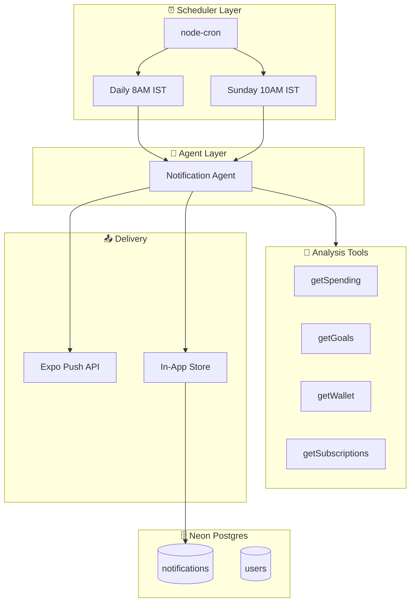
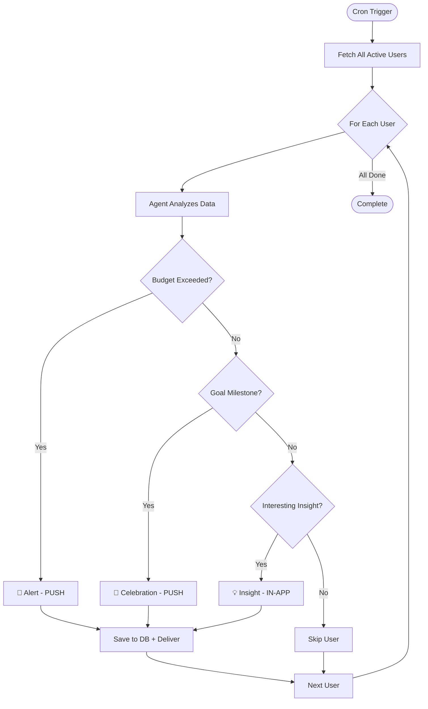

# Notification Agent System

**Tech Stack:** Vercel AI SDK • node-cron • Expo Push • Drizzle ORM  
**Purpose:** Autonomous agents that analyze user financial data and send personalized notifications

> 📖 **For complete code, see:** [agents_ref.md](./agents_ref.md)

---

## System Architecture



---

## Agent Decision Flow



---

## Notification Types

| Type | Priority | Trigger | Example |
|------|----------|---------|---------|
| 🚨 **Alert** | Push | Budget exceeded | "Food budget is 100% used!" |
| 🎉 **Celebration** | Push | Goal milestone | "You're 75% to your PS5! 🎮" |
| 💡 **Insight** | In-App | Pattern detected | "You spend 60% more on weekends" |
| ⏰ **Reminder** | Push | Subscription due | "Netflix renews tomorrow (₹649)" |

---

## Agent Tools

| Tool | Purpose | Data Retrieved |
|------|---------|----------------|
| `getSpending` | Analyze spending patterns | Total spent, by category, avg/day |
| `getGoals` | Check goal progress | Featured goal, % complete, goals at risk |
| `getWallet` | Get current balances | Primary, savings, total balance |
| `getSubscriptions` | Check upcoming renewals | Subscriptions due in next 7 days |

---

## File Structure

```
apps/backend/
├── agents/
│   └── notificationAgent.js
├── jobs/
│   └── cronJobs.js
├── services/
│   ├── notificationService.js
│   └── contextAggregator.js
└── routes/
    └── notificationRoutes.js

apps/mobile/
├── hooks/
│   └── useNotifications.ts
└── services/
    └── pushSetup.ts
```

---

## Cron Schedule

| Job | Time (IST) | Cron Expression | Purpose |
|-----|------------|-----------------|---------|
| Daily Notifications | 8:00 AM | `30 2 * * *` | Analyze all users, send insights |
| Weekly Recap | Sunday 10:00 AM | `30 4 * * 0` | Send weekly summary |
| Subscription Check | 9:00 AM | `30 3 * * *` | Remind about upcoming renewals |

---

## Dependencies

```json
{
  "@ai-sdk/gateway": "^1.0.0",
  "ai": "^6.0.0",
  "node-cron": "^4.2.0",
  "zod": "^4.0.0"
}
```

---

## Implementation Timeline

| Day | Task |
|-----|------|
| 1 | Create agent + context aggregator |
| 2 | Create notification service + cron jobs |
| 3 | Create API routes, update server.js |
| 4 | Mobile: useNotifications + pushSetup |
| 5 | Testing & polish |
