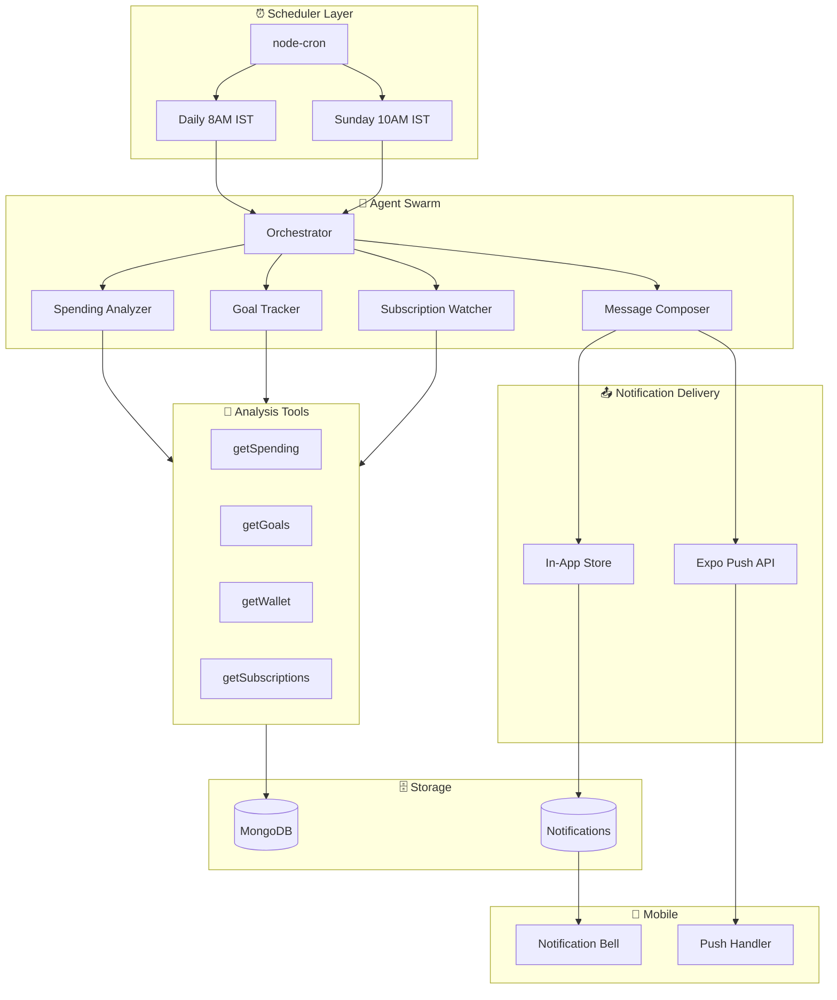
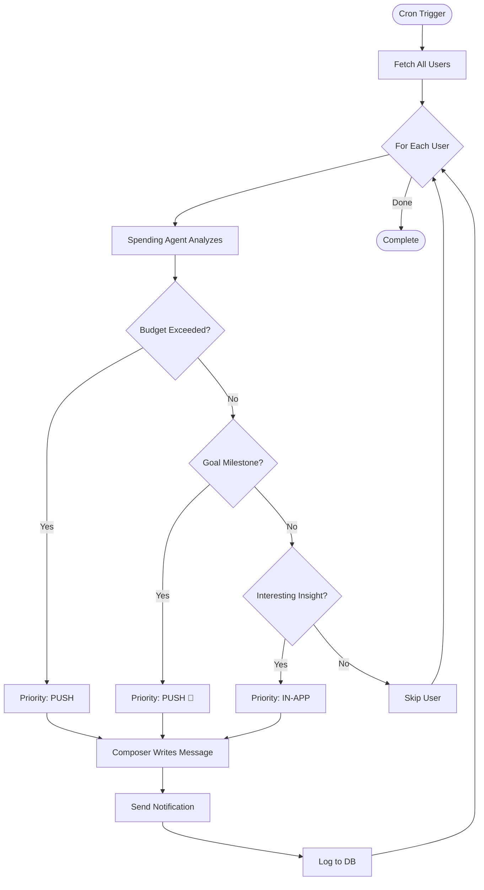

# Notification Agent System

**Tech Stack:** Vercel AI SDK • node-cron • Expo Push • Express.js  
**Purpose:** Autonomous agents that analyze user data and send personalized notifications

---

## System Architecture



---

## Agent Decision Flow



---

## Notification Types

| Type | Priority | Trigger | Example |
|------|----------|---------|---------|
| 🚨 **Alert** | Push | Budget exceeded | "Food budget is 100% used!" |
| 🎉 **Celebration** | Push | Goal milestone | "You're 75% to your PS5!" |
| 💡 **Insight** | In-App | Pattern detected | "You spend 60% more on weekends" |
| ⏰ **Reminder** | Push | Subscription due | "Netflix renews tomorrow (₹649)" |

---

## File Structure

```
apps/backend/
├── agents/
│   └── notificationAgent.js    # [NEW] Main agent logic
├── jobs/
│   └── cronJobs.js             # [NEW] Cron schedules
├── services/
│   ├── notificationService.js  # [NEW] Push + in-app delivery
│   └── contextAggregator.js    # [NEW] Data fetchers
├── models/
│   └── Notification.js         # [NEW] Notification schema
├── routes/
│   └── notificationRoutes.js   # [NEW] API for mobile
└── server.js                   # [MODIFY] Import cron + routes

apps/mobile/
├── hooks/
│   └── useNotifications.ts     # [NEW] Fetch notifications
└── services/
    └── pushSetup.ts            # [NEW] Register push token
```

---

## Backend Code

### agents/notificationAgent.js

```javascript
import { generateText, tool } from "ai";
import { google } from "@ai-sdk/google";
import { z } from "zod";
import { getWalletContext, getTransactionContext, getGoalContext } 
  from "../services/contextAggregator.js";
import { sendPushNotification, saveInAppNotification } 
  from "../services/notificationService.js";

const AGENT_PROMPT = `You are Pally's notification brain. 
Analyze the user's financial data and decide if they need a notification.

RULES:
- Max 1 push notification per day (unless urgent)
- Celebrate wins (savings milestones, streaks)
- Warn about problems (overspending, goals at risk)
- Be specific with ₹ amounts
- Push messages ≤100 characters
- Use 1-2 emojis max

RESPOND WITH JSON:
{
  "shouldNotify": boolean,
  "type": "alert" | "celebration" | "insight" | "reminder",
  "priority": "push" | "in-app",
  "title": "short title",
  "body": "notification message",
  "reason": "why you made this decision"
}`;

export async function runNotificationAgent(userId) {
  const result = await generateText({
    model: google("gemini-2.0-flash"),
    system: AGENT_PROMPT,
    tools: {
      getSpending: tool({
        description: "Get user's spending for analysis",
        parameters: z.object({ days: z.number().default(7) }),
        execute: ({ days }) => getTransactionContext(userId, { days }),
      }),
      getGoals: tool({
        description: "Get user's savings goals and progress",
        parameters: z.object({}),
        execute: () => getGoalContext(userId),
      }),
      getWallet: tool({
        description: "Get wallet balances",
        parameters: z.object({}),
        execute: () => getWalletContext(userId),
      }),
    },
    maxSteps: 3,
    prompt: `Analyze user ${userId} and decide if notification needed.`,
  });

  const decision = JSON.parse(result.text);
  
  if (!decision.shouldNotify) {
    console.log(`[Agent] Skip ${userId}: ${decision.reason}`);
    return null;
  }

  if (decision.priority === "push") {
    await sendPushNotification(userId, decision.title, decision.body);
  }
  await saveInAppNotification(userId, decision);
  
  return decision;
}
```

### jobs/cronJobs.js

```javascript
import cron from "node-cron";
import User from "../models/User.js";
import { runNotificationAgent } from "../agents/notificationAgent.js";

// Daily at 8:00 AM IST (2:30 AM UTC)
cron.schedule("30 2 * * *", async () => {
  console.log("[Cron] Starting daily notification run...");
  
  const users = await User.find({ onboardingCompleted: true }).select("_id");
  let notified = 0;

  for (const user of users) {
    const result = await runNotificationAgent(user._id.toString());
    if (result?.shouldNotify) notified++;
  }

  console.log(`[Cron] Done. Notified ${notified}/${users.length} users.`);
});

// Weekly on Sunday at 10:00 AM IST (4:30 AM UTC)
cron.schedule("30 4 * * 0", async () => {
  console.log("[Cron] Starting weekly recap...");
  // Weekly summary agent logic here
});

console.log("[Cron] Scheduled: Daily 8AM IST, Weekly Sunday 10AM IST");
```

### services/notificationService.js

```javascript
import Notification from "../models/Notification.js";
import User from "../models/User.js";

const EXPO_PUSH_URL = "https://exp.host/--/api/v2/push/send";

export async function sendPushNotification(userId, title, body) {
  const user = await User.findById(userId);
  if (!user?.expoPushToken) return false;

  await fetch(EXPO_PUSH_URL, {
    method: "POST",
    headers: { "Content-Type": "application/json" },
    body: JSON.stringify({
      to: user.expoPushToken,
      title,
      body,
      sound: "default",
    }),
  });
  
  return true;
}

export async function saveInAppNotification(userId, { type, title, body }) {
  return Notification.create({ 
    userId, 
    type, 
    title, 
    body, 
    read: false 
  });
}

export async function getUnreadNotifications(userId) {
  return Notification.find({ userId, read: false })
    .sort({ createdAt: -1 })
    .limit(20);
}
```

---

## Model Updates

### models/Notification.js [NEW]

```javascript
import mongoose from "mongoose";

const schema = new mongoose.Schema({
  userId: { 
    type: mongoose.Schema.Types.ObjectId, 
    ref: "User", 
    required: true 
  },
  type: { 
    type: String, 
    enum: ["alert", "insight", "celebration", "reminder"], 
    required: true 
  },
  title: { type: String, required: true },
  body: { type: String, required: true },
  read: { type: Boolean, default: false },
}, { timestamps: true });

schema.index({ userId: 1, createdAt: -1 });

export default mongoose.model("Notification", schema);
```

### models/User.js [MODIFY]

```diff
+ expoPushToken: { type: String, default: null },
```

---

## Dependencies

```json
{
  "@ai-sdk/google": "^1.0.0",
  "ai": "^4.0.0",
  "node-cron": "^3.0.3",
  "zod": "^3.23.0"
}
```

## Environment Variables

```env
GOOGLE_GENERATIVE_AI_API_KEY=your_gemini_api_key
```

---

## Implementation Timeline

| Day | Task | Deliverable |
|-----|------|-------------|
| 1 | Agent + tools | notificationAgent.js working |
| 2 | Cron + service | Scheduled runs + push delivery |
| 3 | Model + routes | Notification storage + API |
| 4 | Mobile hooks | Push registration + bell UI |
| 5 | Testing | End-to-end notification flow |
