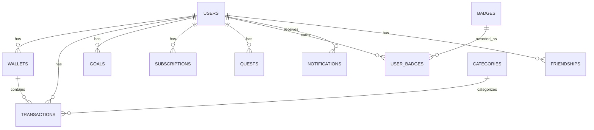

# Database Schema Requirements for AI Features

**Migration:** MongoDB → Neon Postgres  
**Purpose:** Document all fields needed by chatbot tools and notification agents

---

## Schema Overview



---

## Tables & Fields

### 1. users

| Field | Type | Used By | Purpose |
|-------|------|---------|---------|
| `id` | UUID (PK) | All tools | User identifier |
| `name` | VARCHAR | `getFriendStats` | Display name |
| `phone` | VARCHAR | - | Auth |
| `level` | INTEGER | `getStreakStatus`, `getLeaderboard` | Gamification level |
| `coins` | INTEGER | `getLeaderboard` | In-app currency |
| `avatar_url` | VARCHAR | `getFriendStats` | Profile image |
| `friend_code` | VARCHAR | - | Social |
| `kyc_completed` | BOOLEAN | `getWalletBalance` | KYC status |
| `onboarding_completed` | BOOLEAN | Notification agent | Target active users |
| `total_goals_completed` | INTEGER | `getLeaderboard` | Stats |
| `expo_push_token` | VARCHAR | Notification agent | Push delivery |
| `created_at` | TIMESTAMP | - | Audit |
| `updated_at` | TIMESTAMP | - | Audit |

---

### 2. wallets

| Field | Type | Used By | Purpose |
|-------|------|---------|---------|
| `id` | UUID (PK) | - | Wallet identifier |
| `user_id` | UUID (FK) | `getWalletBalance` | Owner |
| `type` | ENUM('primary', 'savings') | `getWalletBalance` | Wallet type |
| `balance` | DECIMAL | `getWalletBalance`, Notification agent | Current balance |
| `ppi_type` | ENUM('small_ppi', 'full_kyc_ppi') | `getWalletBalance` | PPI limits |
| `monthly_loaded` | DECIMAL | `getWalletBalance` | Monthly tracking |
| `last_load_reset` | TIMESTAMP | - | Monthly reset |
| `created_at` | TIMESTAMP | - | Audit |
| `updated_at` | TIMESTAMP | - | Audit |

---

### 3. transactions

| Field | Type | Used By | Purpose |
|-------|------|---------|---------|
| `id` | UUID (PK) | - | Transaction identifier |
| `user_id` | UUID (FK) | All spending tools | Owner |
| `wallet_id` | UUID (FK) | `getRecentTransactions` | Source wallet |
| `category_id` | UUID (FK) | `getCategoryBreakdown` | Category link |
| `name` | VARCHAR | `getRecentTransactions`, RAG search | Transaction name |
| `emoji` | VARCHAR | `getRecentTransactions` | Display |
| `amount` | DECIMAL | All spending tools | Amount (negative = expense) |
| `type` | ENUM('expense', 'income', 'transfer') | `getSpendingSummary` | Transaction type |
| `note` | TEXT | RAG search | User notes |
| `created_at` | TIMESTAMP | All spending tools | Date filtering |
| `updated_at` | TIMESTAMP | - | Audit |

> **Note:** Add `name_embedding` (VECTOR(768)) column for semantic search RAG

---

### 4. categories

| Field | Type | Used By | Purpose |
|-------|------|---------|---------|
| `id` | UUID (PK) | - | Category identifier |
| `name` | VARCHAR | `getCategoryBreakdown` | Category name |
| `emoji` | VARCHAR | `getRecentTransactions` | Display |
| `color` | VARCHAR | - | UI color |

---

### 5. goals

| Field | Type | Used By | Purpose |
|-------|------|---------|---------|
| `id` | UUID (PK) | - | Goal identifier |
| `user_id` | UUID (FK) | `getGoals`, Notification agent | Owner |
| `name` | VARCHAR | `getGoals` | Goal name |
| `emoji` | VARCHAR | `getGoals` | Display |
| `category` | VARCHAR | - | Goal category |
| `color` | VARCHAR | - | UI color |
| `target_amount` | DECIMAL | `getGoals`, Notification agent | Target |
| `current_amount` | DECIMAL | `getGoals`, Notification agent | Progress |
| `is_featured` | BOOLEAN | `getGoals` | Featured goal |
| `is_completed` | BOOLEAN | `getGoals` | Completion status |
| `target_date` | DATE | - | Deadline |
| `created_at` | TIMESTAMP | - | Audit |
| `updated_at` | TIMESTAMP | - | Audit |

> **Computed:** `progress = current_amount / target_amount`

---

### 6. subscriptions

| Field | Type | Used By | Purpose |
|-------|------|---------|---------|
| `id` | UUID (PK) | - | Subscription identifier |
| `user_id` | UUID (FK) | `getSubscriptions` | Owner |
| `name` | VARCHAR | `getSubscriptions` | Service name |
| `price` | DECIMAL | `getSubscriptions` | Amount |
| `category` | VARCHAR | - | Category |
| `start_date` | DATE | - | Start |
| `renewal_cycle` | ENUM('monthly', 'yearly', 'weekly') | `getSubscriptions` | Frequency |
| `status` | ENUM('active', 'cancelled', 'paused') | `getSubscriptions` | Status |
| `next_renewal` | DATE | `getSubscriptions`, Notification agent | Next payment |
| `created_at` | TIMESTAMP | - | Audit |
| `updated_at` | TIMESTAMP | - | Audit |

---

### 7. quests

| Field | Type | Used By | Purpose |
|-------|------|---------|---------|
| `id` | UUID (PK) | - | Quest identifier |
| `user_id` | UUID (FK) | `getActiveQuests` | Owner |
| `title` | VARCHAR | `getActiveQuests` | Quest title |
| `description` | TEXT | - | Details |
| `type` | VARCHAR | - | Quest type |
| `requirement_action` | VARCHAR | - | What to do |
| `requirement_target` | INTEGER | `getActiveQuests` | Target number |
| `progress` | INTEGER | `getActiveQuests` | Current progress |
| `reward_coins` | INTEGER | `getActiveQuests` | Coin reward |
| `reward_xp` | INTEGER | - | XP reward |
| `difficulty` | ENUM('easy', 'medium', 'hard') | - | Difficulty |
| `completed` | BOOLEAN | `getActiveQuests` | Completion |
| `expires_at` | TIMESTAMP | - | Expiry |
| `created_at` | TIMESTAMP | - | Audit |

---

### 8. badges

| Field | Type | Used By | Purpose |
|-------|------|---------|---------|
| `id` | UUID (PK) | - | Badge identifier |
| `name` | VARCHAR | `getBadges` | Badge name |
| `emoji` | VARCHAR | `getBadges` | Display |
| `description` | TEXT | `getBadges` | Description |
| `category` | VARCHAR | `getBadges` | Badge category |

---

### 9. user_badges

| Field | Type | Used By | Purpose |
|-------|------|---------|---------|
| `id` | UUID (PK) | - | Record identifier |
| `user_id` | UUID (FK) | `getBadges` | Owner |
| `badge_id` | UUID (FK) | `getBadges` | Badge earned |
| `earned_at` | TIMESTAMP | `getBadges` | When earned |

---

### 10. friendships

| Field | Type | Used By | Purpose |
|-------|------|---------|---------|
| `id` | UUID (PK) | - | Friendship identifier |
| `user_id` | UUID (FK) | `getLeaderboard`, `getFriendStats` | User 1 |
| `friend_id` | UUID (FK) | `getLeaderboard`, `getFriendStats` | User 2 |
| `status` | ENUM('pending', 'accepted', 'rejected') | - | Status |
| `created_at` | TIMESTAMP | - | Audit |

---

### 11. notifications (NEW)

| Field | Type | Used By | Purpose |
|-------|------|---------|---------|
| `id` | UUID (PK) | - | Notification identifier |
| `user_id` | UUID (FK) | Notification agent | Recipient |
| `type` | ENUM('alert', 'insight', 'celebration', 'reminder') | Notification agent | Type |
| `title` | VARCHAR | Notification agent | Title |
| `body` | TEXT | Notification agent | Message |
| `read` | BOOLEAN | Mobile UI | Read status |
| `created_at` | TIMESTAMP | Mobile UI | Timestamp |

---

### 12. conversation_memory (NEW - for RAG)

| Field | Type | Used By | Purpose |
|-------|------|---------|---------|
| `id` | UUID (PK) | - | Message identifier |
| `user_id` | UUID (FK) | RAG retrieval | Owner |
| `role` | ENUM('user', 'assistant') | RAG | Message role |
| `content` | TEXT | RAG | Message text |
| `summary` | TEXT | RAG | Summarized version |
| `embedding` | VECTOR(768) | RAG | Embedding for search |
| `created_at` | TIMESTAMP | RAG | Timestamp |

---

## Indexes Required

```sql
-- Performance indexes for AI tools
CREATE INDEX idx_transactions_user_date ON transactions(user_id, created_at DESC);
CREATE INDEX idx_transactions_user_category ON transactions(user_id, category_id);
CREATE INDEX idx_goals_user_featured ON goals(user_id, is_featured);
CREATE INDEX idx_subscriptions_user_status ON subscriptions(user_id, status);
CREATE INDEX idx_quests_user_completed ON quests(user_id, completed);
CREATE INDEX idx_notifications_user_read ON notifications(user_id, read, created_at DESC);
CREATE INDEX idx_friendships_user ON friendships(user_id, status);

-- Vector indexes for RAG (using pgvector)
CREATE INDEX idx_transactions_embedding ON transactions 
  USING ivfflat (name_embedding vector_cosine_ops);
CREATE INDEX idx_conversation_embedding ON conversation_memory 
  USING ivfflat (embedding vector_cosine_ops);
```

---

## Tool → Table Mapping

| Tool | Tables Queried |
|------|----------------|
| `getWalletBalance` | users, wallets |
| `getRecentTransactions` | transactions, categories |
| `getSpendingSummary` | transactions |
| `getCategoryBreakdown` | transactions, categories |
| `getGoals` | goals |
| `getSubscriptions` | subscriptions |
| `explainChart` | transactions |
| `compareSpending` | transactions |
| `getTopSpendingDays` | transactions |
| `findLargeTransactions` | transactions |
| `getStreakStatus` | users |
| `getActiveQuests` | quests |
| `getBadges` | badges, user_badges |
| `getLeaderboard` | users, friendships |
| `getFriendStats` | users, friendships |
| **Notification Agent** | users, wallets, transactions, goals, subscriptions |
| **RAG Search** | transactions (embedding), conversation_memory |
