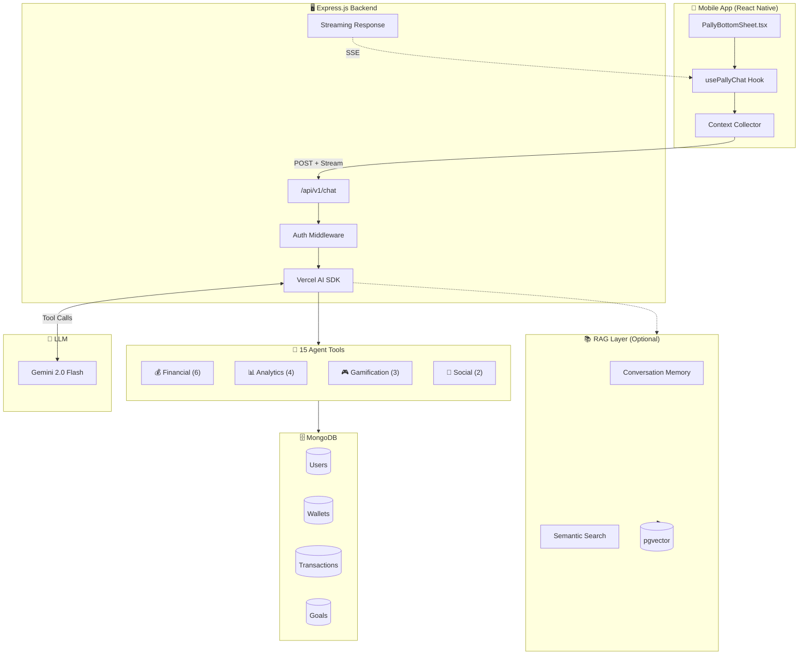
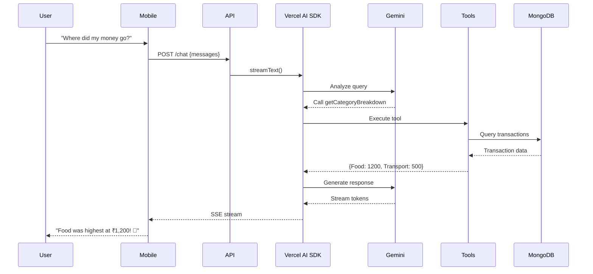
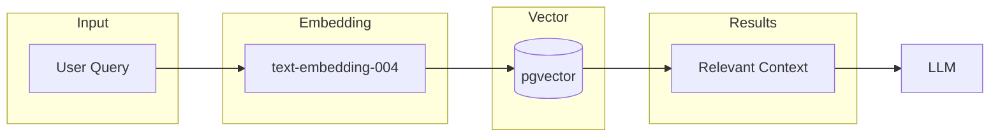

# Pally AI Chatbot Implementation Plan

**Tech Stack:** Vercel AI SDK • Google Gemini • Express.js • React Native  
**Approach:** Tools-first with optional RAG for memory and semantic search

---

## System Architecture



---

## Request-Response Flow



---

## Tool Definitions (15 Total)

### 💰 Category 1: Financial Data (6 tools)

| Tool | Parameters | Returns | Example Query |
|------|------------|---------|---------------|
| `getWalletBalance` | none | `{ primary, savings, total }` | "What's my balance?" |
| `getRecentTransactions` | `limit?, days?, category?` | Transaction list | "Show my food expenses" |
| `getSpendingSummary` | `period: week/month/3m` | `{ totalSpent, avgPerDay }` | "How much did I spend?" |
| `getCategoryBreakdown` | `period` | `{ Food: 1200, ... }` | "Where did my money go?" |
| `getGoals` | none | Goals with progress | "How are my goals?" |
| `getSubscriptions` | none | Active subscriptions | "What subscriptions do I have?" |

### 📊 Category 2: Analytics & Insights (4 tools)

| Tool | Parameters | Returns | Example Query |
|------|------------|---------|---------------|
| `explainChart` | `period, chartType` | Insights object | "Explain this graph" |
| `compareSpending` | `period1, period2` | Comparison data | "Am I spending more than last week?" |
| `getTopSpendingDays` | `days` | Ranked days | "When do I spend most?" |
| `findLargeTransactions` | `threshold?, days?` | Big purchases | "Any big expenses recently?" |

### 🎮 Category 3: Gamification (3 tools)

| Tool | Parameters | Returns | Example Query |
|------|------------|---------|---------------|
| `getStreakStatus` | none | Streak info | "How's my streak?" |
| `getActiveQuests` | none | Quest list + progress | "What quests do I have?" |
| `getBadges` | none | Earned + available | "What badges have I earned?" |

### 👥 Category 4: Social (2 tools)

| Tool | Parameters | Returns | Example Query |
|------|------------|---------|---------------|
| `getLeaderboard` | `type: coins/goals` | Ranked friends | "Where am I on the leaderboard?" |
| `getFriendStats` | `friendId?` | Friend comparison | "How's Rahul doing?" |

---

## RAG Use Cases (Optional)



| Use Case | What It Does | When Needed |
|----------|--------------|-------------|
| **Conversation Memory** | Store past chats, recall context | "Remember when I said I'm saving for a PS5?" |
| **Transaction Search** | Semantic search on transaction names | "Find that Uber ride from last month" |

---

## File Structure

```
apps/backend/
├── routes/
│   └── chatRoutes.js           # [NEW] Chat endpoint
├── controllers/
│   └── chatController.js       # [NEW] Stream handler
├── services/
│   ├── chatTools.js            # [NEW] 15 tool implementations
│   └── contextAggregator.js    # [NEW] Data fetchers
└── server.js                   # [MODIFY] Add chat route

apps/mobile/
├── hooks/
│   └── usePallyChat.ts         # [NEW] Streaming hook
└── components/pally/
    └── PallyBottomSheet.tsx    # [MODIFY] Real API integration
```

---

## Backend Code

### controllers/chatController.js

```javascript
import { streamText, tool } from "ai";
import { google } from "@ai-sdk/google";
import { z } from "zod";
import * as tools from "../services/chatTools.js";

const SYSTEM_PROMPT = `You are Pally, a friendly finance assistant for PocketPal.
- Warm, encouraging tone with emojis
- Give specific advice with actual numbers
- Keep responses concise for mobile
- Celebrate wins, be empathetic about overspending`;

export const streamChat = async (req, res) => {
  const { messages } = req.body;
  const userId = req.user.id;

  const result = streamText({
    model: google("gemini-2.0-flash"),
    system: SYSTEM_PROMPT,
    messages,
    tools: {
      getWalletBalance: tool({
        description: "Get wallet balances (primary + savings)",
        parameters: z.object({}),
        execute: () => tools.getWalletBalance(userId),
      }),
      getSpendingSummary: tool({
        description: "Get spending total for a period",
        parameters: z.object({ period: z.enum(["week", "month", "3m"]) }),
        execute: ({ period }) => tools.getSpendingSummary(userId, period),
      }),
      getCategoryBreakdown: tool({
        description: "Get spending breakdown by category",
        parameters: z.object({ period: z.enum(["week", "month", "3m"]) }),
        execute: ({ period }) => tools.getCategoryBreakdown(userId, period),
      }),
      getGoals: tool({
        description: "Get savings goals and progress",
        parameters: z.object({}),
        execute: () => tools.getGoals(userId),
      }),
      // ... remaining 11 tools
    },
    maxSteps: 5,
  });

  result.pipeDataStreamToResponse(res);
};
```

---

## Dependencies

```json
{
  "@ai-sdk/google": "^1.0.0",
  "ai": "^4.0.0",
  "zod": "^3.23.0"
}
```

## Environment Variables

```env
GOOGLE_GENERATIVE_AI_API_KEY=your_gemini_api_key
```

---

## Implementation Timeline

| Day | Task | Deliverable |
|-----|------|-------------|
| 1 | Setup + routes | Chat endpoint working |
| 2 | Implement 15 tools | All tools querying DB |
| 3 | Mobile hook | Streaming in UI |
| 4 | Testing | All queries working |
| 5 | RAG (optional) | Memory + search |
